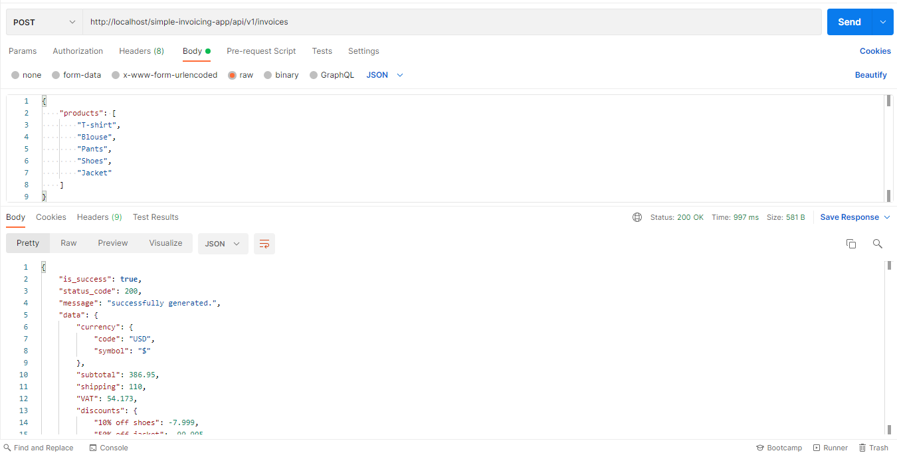

### Description
An app that can price a cart of products from different countries, accept multiple products, combine offers, and display a total detailed invoice in USD by default which is developed based on REST API (this app focuses on back-end).

### Technical Reasoning
The app is built on Laravel and [Laragine](https://github.com/yepwoo/laragine) due to the following reasons:
* A module based, meaning that you can separate all related stuff together
* Automatic generation of Unit Tests!
* One clear response for the client side (for example: API response)
* Error handling
* Easy to configure channels to send the logs (for example error logs) to channels like `slack`
* It's based on `MVC` **design pattern**

The app also implements best practices like applying `SOLID` principles and `OOD` apart from that the `Strategy` design pattern is used due to having switch cases (many if for example).

Also there is no `DB` needed to run the app as the solution depends on the `configurations` (you can change the configurations from here `core/Sale/config/main.php`)

### Trade-offs
if I was to spend additional time on the project I would do the following:
* Use `Strategy` design pattern in the `offers/discounts` here `core/Sale/Models/Invoice.php`
* Make the `capped_amount` applicable to both negative and positive values (currently it's working with negative values) in line `184` in `core/Sale/Models/Invoice.php`
* Reimplement `uom_converter` function and make it based on `OOP` in `core/Sale/helpers.php`

### Getting started:
* You do not have a `.env` file in the project root directory so copy `.env.example` and save it as `.env`

* In `.env` file update `LOG_SLACK_WEBHOOK_URL` with your slack incoming webhook to send real-time errors that occurs in the system. if you don't have one you can checkout slack by joining from [here](https://join.slack.com/t/newworkspace-kke8575/shared_invite/zt-wompvw7a-QKR3icuaTDbWOPy_UxKFGQ) and then in `general` channel you can find a message contains the incoming webhook

* Open the terminal and navigate to the project directory and run `composer install`

* Generate the application key using `php artisan key:generate`

* Now you can check the invoice API (`POST` request) by using postman (the full url will be something like this: `http://localhost/simple-invoicing-app/api/v1/invoices` depands on where you cloned the project), here is an example from postman:

* You can run the tests by running `./vendor/bin/phpunit` also before running the tests you check the code coverage reports by opening `ci/codeCoverage/index.html` in the browser